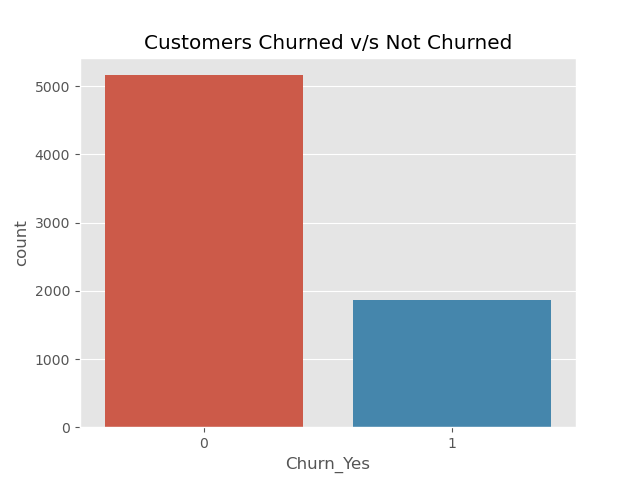
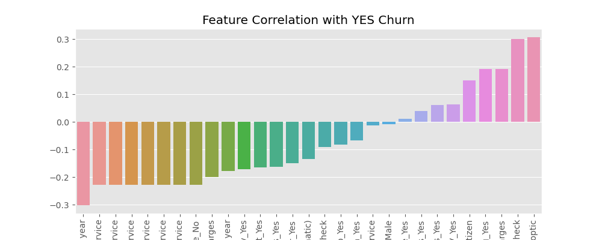
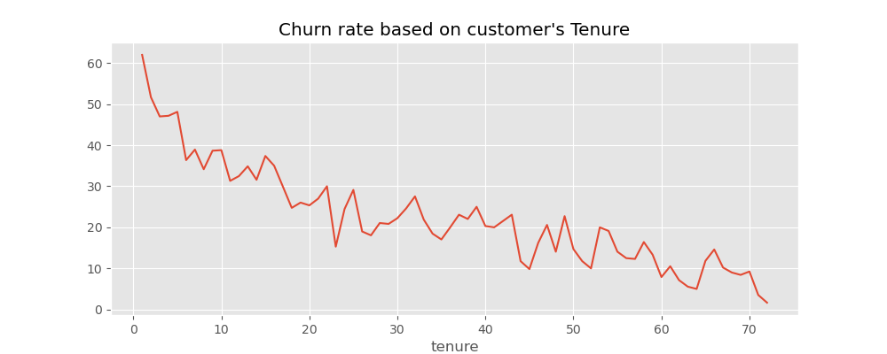
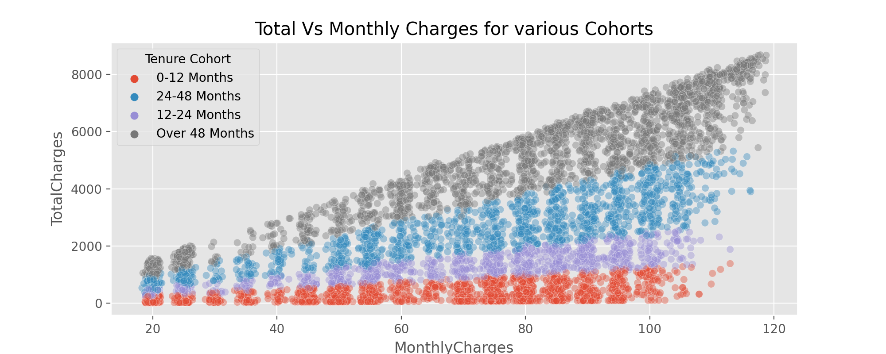
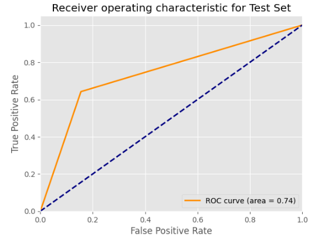
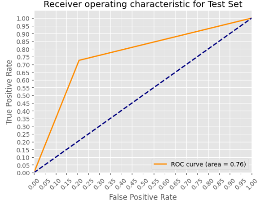

    <h1>California Telco Customer churn Analysis</h1>
        

## Project Overview
Churn, in the context of a telecom company, refers to the process of a customer deciding to discontinue the use of a company's services. It is an important metric for the company to track as it can indicate a decline in customer satisfaction, increased competition, or other factors that may negatively impact the company's revenue and market share. Understanding the reasons behind customer churn and developing strategies to reduce it is a crucial aspect of customer relationship management for telecom companies, as it helps them to retain their existing customer base and maximize their revenue.

## Business Problem
The telecom company is facing a high rate of customer churn, leading to a decline in revenue and loss of market share. The company needs to understand:-
a)the reasons behind customer churn, 
b)identify the segments of customers most likely to churn, 
c)and develop strategies to reduce churn and improve customer retention
  
## Data Understanding
The Telco customer churn data contains information about a fictional telecommunications company that provided home phone and Internet services to 7032 customers in California in Q3. The training dataset contains 7032 samples, each with 21 features and one Boolean variable, "churn," that indicates the class of the sample.

The features in the data are:

* **customerID** - a unique identifier for each customer
* **gender** - indicates the gender of the customer (male or female)
* **SeniorCitizen** - indicates whether the customer is a senior citizen (represented as 1 for yes and 0 for no)
* **Partner** - indicates whether the customer has a partner (represented as "Yes" or "No")
* **Dependents** - indicates whether the customer has dependents, who rely on them as a primary source of income (represented as "Yes" or "No")
* **tenure** - the number of months the customer has been with the company
* **PhoneService** - indicates whether the customer has a phone service (represented as "Yes" or "No")
* **MultipleLines** - indicates whether the customer has multiple phone lines (represented as "Yes," "No," or "No phone service")
* **InternetService** - the customer's internet service provider (represented as "DSL," "Fiber optic," or "No")
* **OnlineSecurity** - indicates whether the customer has online security (represented as "Yes," "No," or "No internet service")
* **OnlineBackup** - indicates whether the customer has online backup (represented as "Yes," "No," or "No internet service")
* **DeviceProtection** - indicates whether the customer has device protection (represented as "Yes," "No," or "No internet service")
* **TechSupport** - indicates whether the customer has tech support (represented as "Yes," "No," or "No internet service")
* **StreamingTV** - indicates whether the customer has streaming TV (represented as "Yes," "No," or "No internet service")
* **StreamingMovies** - indicates whether the customer has streaming movies (represented as "Yes," "No," or "No internet service")
* **Contract** - indicates the type of contract the customer has according to duration (represented as "Month-to-month," "One year," or "Two year")
* **PaperlessBilling** - indicates whether the customer's bills are issued in paperless form (represented as "Yes" or "No")
* **PaymentMethod** - the payment method used by the customer (represented as "Electronic check," "Mailed check," "Credit card (automatic)," or "Bank transfer (automatic)")
* **MonthlyCharges** - the amount charged for service on a monthly basis
* **TotalCharges** - the cumulative charges for service during the customer's subscription (tenure) period
* **Churn** - the target variable that we are trying to predict or estimate, indicating whether the customer has left, stayed, or signed up for the service.

## Metric of Success

* High Accuracy is needed
* Since we are dealing with an imbalanced dataset,we will keep track of the Recall and confusion matrix

* **Accuracy** = Number of correctly predited test samples/Total number of test sample

* **Recall** = True Positives/ (True positive + False negatives)
* **F1 Score** which is a harmonic mean of precison and recall will be our measure of the model performance
* **ROC_AUC score** which shows how well the model is performing in terms of classifying the values

## Data Preparation

This stage involves cleaning, transforming, and organizing data so that it can be used for a specific task or analysis.The activitie here involves data cleaning, transformations and normalization.

## Data Exploration
**The goal of is to understand the structure, patterns, and relationships in the data.We wil first look at the distribution of data in our target variable**

From the plot we notice a class imbalace issue, which we try to sort later on with SMOTE, and oversampling technique

**We also look at how features are correlated to the target variable using a barplot**

The graph shows features that are positively correlated to the target feature on the upper side while the ones that have a negative correlation on the lower side

**Trendline showing the churn rate as relates to the the tenure a customer has stayed in a company**

The Churn rate decreases with increase in tenure

**A deeper look at different cohorts of customers showing their monthly charges against total charges and thier Churn rate**

The company gets more venue from longer term customers compared to short term

## Modeling

### The Baseline Model: Logistic Regression

Logistic regression is used to estimate the probability of descrete values based on a given dataset of independent variables. Since the outcome is a probability, the dependent variable is bounded between 0 and 1. In logistic regression, a logit transformation is applied on the odds—that is, the probability of success divided by the probability of failure. This is also commonly known as the log odds, or the natural logarithm of odds. We will use it as our baseline model since It is very fast at classifying unknown records.

The ROC score is 74% which shows our model is performing quite well But we can impove on it as a score of close to 100% is the best

### Best Model: Random Forest
Random Forest is an ensemble technique capable of performing both regression and classification tasks with the use of multiple decision trees and a technique called Bootstrap and Aggregation, commonly known as bagging. The basic idea behind this is to combine multiple decision trees in determining the final output rather than relying on individual decision trees.Random forest has an advantage of low variance compared to decision tree.

We get an ROC of 76% which is a reasonable accuracy, but there is room for improvement.For instance using we can try to use models that more advanced in classifying imbalanced data such as Convolutional Neural Networks

### Conclusion

In conclusion the Random forest and Adaboost tied with compared to the random forest classifier,Xgboost following closely. In terms of precison and recall I will go for random Forest as it has better precision compared to other models. Logistic and Knn also did quite well as  there was only a margin of 5% between the best(F1 score of 61% on the 1 class (churn) and 85% on the 0 class(not chur))  model and the one that did not perform quite well Knn. The best average F1 score was 74%. The score didnt change much even after over sampling and using parameter tuning techniques for each model using gridSearch.

The Model's bests features are tenure,total charges, Monthly charges,contract type,internet service especially fibre optic, Tenure cohort and online security

To challenge the solution, As we saw earlier, our target class data was very imbalance. We  can say that the data collection on the 'not churn' class was much higher compared to the 'churn yes'. 
I will also need to do more search on best models that can handle imbalanced data well, or train a single class to see how to learns and predict the unseen data

### Recommendations

From the Analysis, More attention should be given to customers who are on month-to-Month contract and have stayed with the company for long. This can help reduce the churn rate realized in this class of contract. customers on Month-to-Month contract dont bring more income to the company as evidenced in the in the plot above if encouraged to join the contracts more than a year. The companys would gain more money.A high churn rate is also seen for customers who are subscribed to the Fibre optic internet service. Better services such as online security and Tech support to could help retain customer base in this sector.

## For More Information
See full analysis in <a href ="index.ipynb">index.ipynb</a> or my presentation <a href ="Analysis of Telco Churn Rate.pdf">here</a>

# Repository Structure

├── data 
├── images 
├── README.md 
├── Analysis of Telco Churn Rate.pdf 
└── index.ipynb

